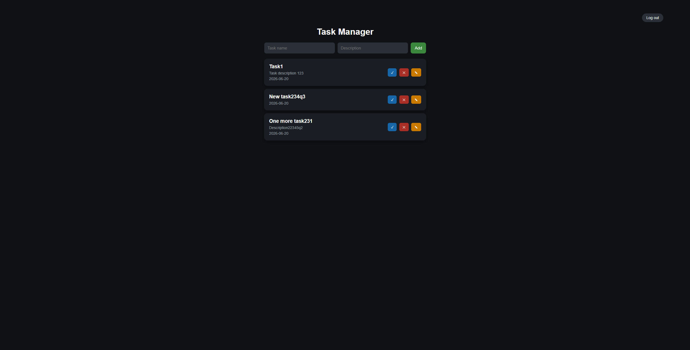
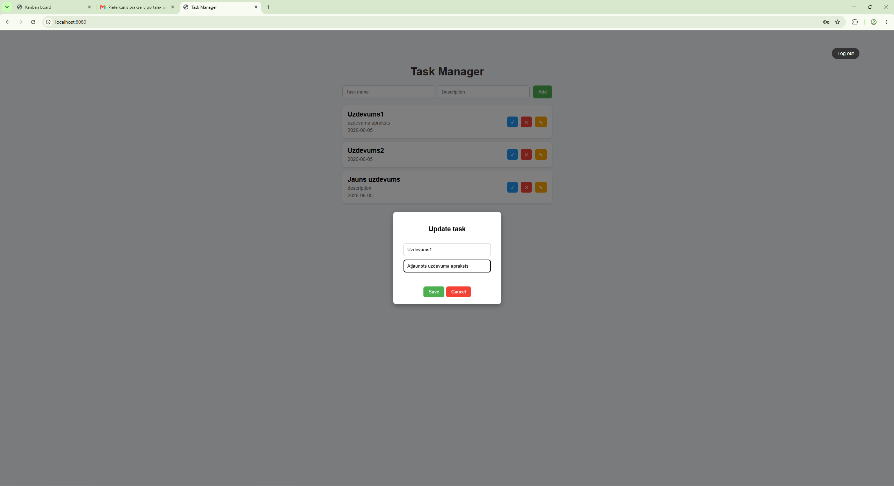
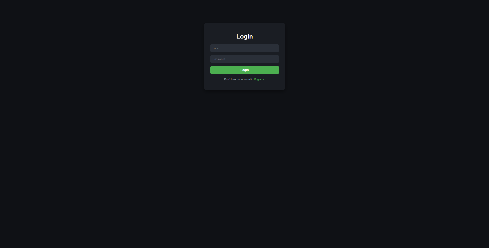
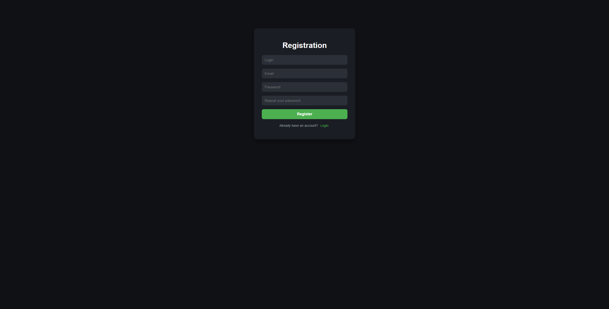

# Task Manager API

A REST API for managing tasks built with Spring Boot and PostgreSQL.

## About

This project was built to practice:

- Spring Boot fundamentals
- REST API development
- PostgreSQL integration
- Docker containerization

## Features

- Create tasks
- View all tasks
- Update tasks
- Delete tasks
- PostgreSQL database integration
- Dockerized deployment with Docker Compose

## Tech Stack

- Java 21
- Spring Boot
- Spring Data JPA
- PostgreSQL
- Docker
- Docker Compose
- Maven

## Preview

### Here are some screenshots from my project

### Main page:



### Task update modal:



### Login page: 

 

### Registration page: 




## Getting Started

### Prerequisites

- Java 21+
- Maven
- Docker
- Docker Compose

### Clone the Repository

```bash
git clone https://github.com/alekssdz123/Task-manager.git
cd Task-manager
```

## Running Locally

### Start PostgreSQL

```bash
docker compose up db
```

### Run Spring Boot

```bash
./mvnw spring-boot:run
```

Application will be available at:

```text
http://localhost:8080
```

## Running with Docker

Build and start all services:

```bash
docker compose up --build
```

Application:

```text
http://localhost:8080
```

PostgreSQL:

```text
localhost:5432
```
